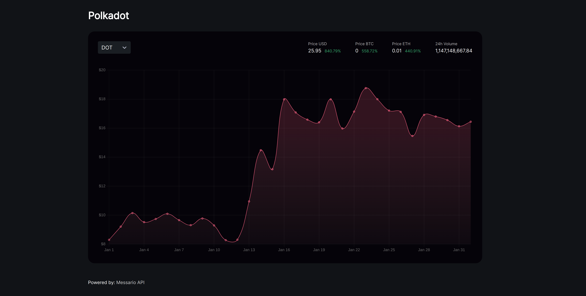

# Messari



## Introduction

This is a web app built to visualize crypocurrency asset data pull from [Messari](https://messari.io/api/docs) public API. The application utilizes Messari's timeseries endpoint to display the closing price of an asset within a specified time interval. It also displays a few metrics such as price of the asset in USD, ETH, BTC on the dashboard.

## Technologies used

- React
- TypeScript
- Emotion.js, for styling
- Vite.js, build tool

## Install and run

```
npm install
npm run dev
```

Visit `http://localhost:3000` in a browser to view the application
